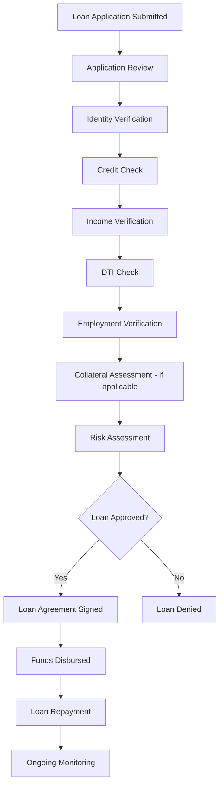

# 📊 Bank Loan Performance Dashboard

## 💡 Understanding about Bank Loan
A bank loan is a sum of money borrowed from a bank by an individual, business, or government, which must be repaid with interest over a set period of time.

> What are the steps in the loan approval process?

> Question ❓ : Why Should Banks Monitor Loan Performance?

- Risk Assesment ([source](https://precisa.in/blog/bank-statement-analyser-solutions-integral-loan-sanctioning/))

  a statement analyser offers detailed insights into a borrower’s financial health and activity. Therefore, it enables lenders to determine the risk involved while lending money to a specific borrower.

- Credit Bank Analysis Decision Making ([source](https://corporatefinanceinstitute.com/resources/commercial-lending/bank-credit-analysis/))

  The credit analysts and loan officers base their decision on the entire analysis. The analysis helps in reaching a decision on whether the risk level is acceptable or not and to what extent. The amount of loan to be awarded to the borrower will depend on whether the lender is convinced that the loan will be repaid within the agreed terms and duration.

  The bank can either approve the total amount of loan requested or decide on a specific amount of loan that is below what the borrower applied for. Whatever the decision, the lender must communicate to the borrower its decision before the disbursement is made.

- Improve Loan Management (Customer Insight) ([source](https://precisa.in/blog/bank-statement-analyser-solutions-integral-loan-sanctioning/))

  A bank statement analyser can assist lenders in managing their loan portfolio with efficiency and identify potential concerns by automating the process of reviewing bank statements.

## 🧹 Data Preprocessing Steps

1. Checked for missing values and duplicates.  
2. Verified the data type of each attribute.  
3. Converted the `issue_date` attribute to **Date** type (this transformation was done in Power BI before visualization).  
4. Created a new **Date Table** in Power BI using DAX, which includes the following attributes:

| 🗂️ Attribute      |📘 Description                                                                 |
|----------------|-----------------------------------------------------------------------------|
| `date`         | The data obtained from the `issue_date` attribute in the financial_loan file. |
| `Month`        | This column is derived from the month value in the `date` column.            |
| `Month Number` | A helper column representing the numeric value of the month.                 |

## 🎯 Dashboard Objective

Before creating an impactful dashboard to monitor Bank Loan Performance, we should first define what information needs to be displayed. Below is a list of problem statements identified after understanding the data and the bank loan process:

1. Display key performance indicators (KPIs) such as: Total Applications, Total Funded Amount, Total Amount Received, Average DTI, and Average Interest Rate.  
2. Visualize the comparison between Good Loans and Bad Loans.  
3. Provide a comprehensive KPI overview grouped by Loan Status.  
4. Analyze trends and breakdowns including: Monthly Trends, Loan Term Analysis, Employment Length Analysis, Loan Purpose Analysis, and Home Ownership Analysis.  
5. Include a detailed table when necessary to view detail  loan information.

# 📈 Dashboard
## 🧩 Summary Page

## 📋 Overview Page

## 🔍 Detail Page

## 💼 Business Insight 
 
- The Month-over-Month (MoM) growth in total loan applications is 6.9%, indicating that this bank is currently trusted by more applicants.

- The total amount received is greater than the total funded amount, which reflects a healthy cash flow for the bank.

- The percentage of bad loans granted is approximately 13.8% (around 5,000 applications). The gap between the total amount received and the funded amount is around -$28.4 million. Although the number of good loans is higher than bad loans, this issue cannot be ignored. A more detailed analysis is needed for each state and contributing factors to minimize the gap between loan disbursement and repayments.

- The **Average DTI** (Debt-to-Income ratio) for loans with a "Current" status is higher than that of loans marked as "Charged Off" and "Fully Paid." This suggests that current loans have the potential to become delinquent and may eventually be charged off if not monitored closely.

- Each key KPI (Total Applications, Total Funded Amount, Total Amount Received) on the Overview Page increased steadily from January to December, indicating that the bank is experiencing consistent growth in loan activities.
  
- Most applicants choose short-term loans instead of long-term ones, while their primary purpose is debt consolidation. This implies faster fund turnover for the bank due to the shorter repayment periods.

## 🧭 Strategies Recomendation

- Continue to upgrade bank services and implement strategic initiatives that enhance the bank’s reputation, making it more attractive for potential borrowers.

- Based on the bad loan rate (13.8%), the bank should strengthen its credit risk assessment methodology, potentially by:

  - Leveraging advanced analytics or AI to evaluate applicants more precisely.

  - Reassessing credit score thresholds or documentation requirements.

- Closely monitor loans with a “Current” status, especially those with a high DTI ratio, to proactively manage risk before they become delinquent.

- Offering more flexible tenor options for borrowers who prefer 36 months.

- Continuously introduce other bank products to borrowers who choose the 60-month term until the loan is fully paid, in order to enhance profit.
